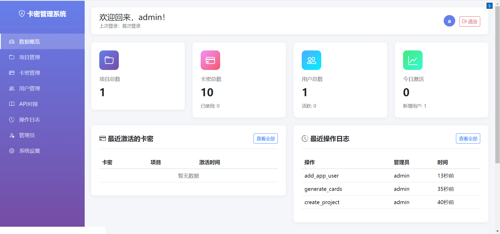
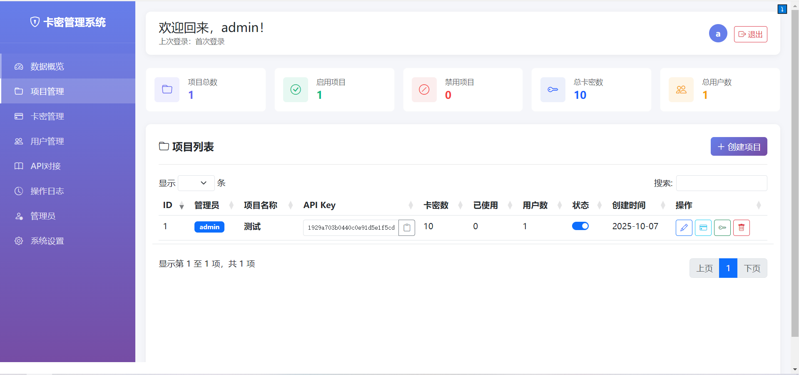
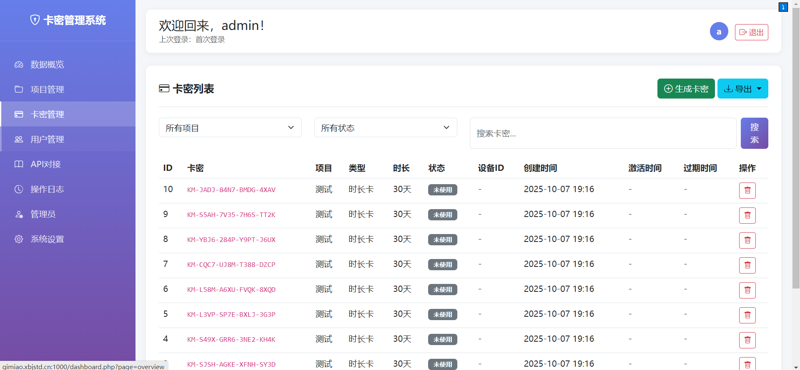
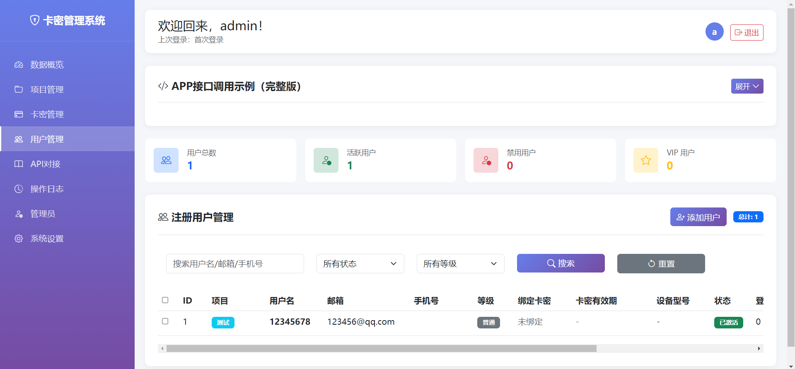

# 卡密管理系统

一个功能完整的卡密授权管理系统，支持APP用户注册登录、卡密生成管理、设备绑定等功能。

## ✨ 图片预览





## ✨ 核心功能

### 🔐 用户系统
- **APP用户注册** - 支持用户名/邮箱/手机号注册
- **用户登录** - 多方式登录，自动生成Token
- **用户管理** - 完整的CRUD操作（增删改查）
  - ✅ 查看所有通过API注册的用户
  - ✅ 用户详情弹窗（显示VIP等级、绑定卡密、登录信息等）
  - ✅ 添加新用户
  - ✅ 编辑用户信息（用户名、邮箱、手机号、VIP等级、余额、状态）
  - ✅ 删除单个用户
  - ✅ 批量删除用户（支持多选）
  - ✅ 禁用/启用用户
  - ✅ 搜索功能（按用户名/邮箱/手机号/设备ID搜索）
  - ✅ 筛选功能（按状态、VIP等级筛选）

### 💳 卡密管理
- **批量生成** - 一次最多生成1000个卡密
- **三种类型** - 时长卡、永久卡、次数卡
- **设备绑定** - 自动绑定设备ID，支持解绑
- **状态管理** - 未使用、已激活、已禁用
- **CSV导出** - 批量导出卡密数据

### 📱 API接口
1. **用户注册** - 创建新用户账号
2. **用户登录** - Token认证登录
3. **获取用户信息** - 查询用户详情和卡密列表
4. **激活卡密** - 激活并绑定设备
5. **验证卡密** - 检查卡密有效性
6. **心跳检测** - 更新用户活跃状态
7. **获取卡密信息** - 查询卡密详情

### 📊 管理功能
- 项目管理 - 多项目独立管理
- 用户管理 - 终端用户列表和状态
- API Key - 生成和管理API访问令牌
- 操作日志 - 完整的操作记录
- 数据统计 - 直观的数据概览

## 🚀 快速开始

### 系统要求
- PHP 7.4+
- PDO SQLite扩展（默认启用）
- Web服务器（Apache/Nginx）

### 安装步骤

1. **上传文件**
   ```
   将所有文件上传到Web服务器目录
   ```

2. **访问系统**
   ```
   浏览器打开：http://你的域名/
   ```

3. **默认登录**
   ```
   用户名：admin
   密码：admin123456
   ```

4. **立即修改密码** ⚠️

### 使用流程

```
1. 创建项目
   ↓
2. 生成卡密
   ↓
3. 生成API Key（可选）
   ↓
4. APP调用接口
   ↓
5. 查看数据统计
```

## 📱 APP对接示例

### Android示例（Java）

```java
// 1. 用户注册
JSONObject json = new JSONObject();
json.put("action", "register");
json.put("username", "testuser");
json.put("password", "123456");
json.put("device_id", getDeviceId());

RequestBody body = RequestBody.create(
    MediaType.parse("application/json"), 
    json.toString()
);

Request request = new Request.Builder()
    .url("http://你的域名/api.php")
    .post(body)
    .build();

client.newCall(request).enqueue(new Callback() {
    @Override
    public void onResponse(Call call, Response response) {
        String result = response.body().string();
        JSONObject data = new JSONObject(result);
        if (data.getBoolean("success")) {
            String token = data.getJSONObject("data").getString("token");
            // 保存token
            saveToken(token);
        }
    }
});

// 2. 激活卡密
JSONObject json = new JSONObject();
json.put("action", "activate");
json.put("card_key", "KM-XXXX-XXXX-XXXX-XXXX");
json.put("device_id", getDeviceId());
json.put("device_model", Build.MODEL);
// 发送请求...

// 3. 验证卡密（APP启动时）
JSONObject json = new JSONObject();
json.put("action", "verify");
json.put("card_key", getCardKey());
json.put("device_id", getDeviceId());
// 发送请求...
```

### 获取设备ID（Android）
```java
String deviceId = Settings.Secure.getString(
    getContentResolver(), 
    Settings.Secure.ANDROID_ID
);
```

## 📋 API接口文档

### 接口地址
```
http://你的域名/api.php
```

### 请求格式
```json
{
    "action": "接口名称",
    "参数1": "值1",
    "参数2": "值2"
}
```

### 返回格式
```json
{
    "success": true,
    "message": "操作成功",
    "timestamp": 1234567890,
    "data": { }
}
```

### 接口列表

| 接口 | action参数 | 必填参数 | 说明 |
|------|-----------|---------|------|
| 用户注册 | register | username, password | 创建新用户 |
| 用户登录 | login | username, password | 登录获取token |
| 获取用户信息 | get_user_info | token | 查询用户详情 |
| 激活卡密 | activate | card_key, device_id | 激活并绑定 |
| 验证卡密 | verify | card_key, device_id | 验证有效性 |
| 心跳检测 | heartbeat | card_key, device_id | 更新活跃 |
| 卡密信息 | get_card_info | card_key | 查询详情 |

> 详细接口文档请登录后台查看"用户管理"页面

## 🔒 安全建议

1. **立即修改默认密码**
2. **使用HTTPS协议**（推荐Let's Encrypt）
3. **定期备份数据库**（kamika.db文件）
4. **保护数据库文件**（.htaccess已配置）
5. **妥善保管API Key**

## 📂 文件结构

```
├── config.php          # 系统配置
├── database.php        # 数据库操作类
├── functions.php       # 公共函数
├── api.php            # API接口
├── index.php          # 登录页
├── dashboard.php      # 管理后台
├── logout.php         # 退出
├── pages/             # 后台页面
│   ├── overview.php   # 数据概览
│   ├── projects.php   # 项目管理
│   ├── cards.php      # 卡密管理
│   ├── users.php      # 用户管理（含API示例）
│   ├── api.php        # API Key
│   ├── logs.php       # 操作日志
│   ├── admins.php     # 管理员
│   └── settings.php   # 系统设置
├── kamika.db          # SQLite数据库（自动生成）
└── README.md          # 本文件
```

## 💡 开发提示

### 推荐技术栈（Android）
- **网络请求**: OkHttp + Retrofit
- **JSON解析**: Gson
- **数据存储**: SharedPreferences / Room
- **异步处理**: RxJava / Coroutines

### 建议实现
```java
// 封装API管理类
public class ApiManager {
    private static final String API_URL = "http://你的域名/api.php";
    
    public void register(String username, String password, Callback callback) {
        // 发送注册请求
    }
    
    public void login(String username, String password, Callback callback) {
        // 发送登录请求
    }
    
    public void verifyCard(String cardKey, Callback callback) {
        // 验证卡密
    }
    
    // 定时心跳
    private void startHeartbeat() {
        Timer timer = new Timer();
        timer.schedule(new TimerTask() {
            @Override
            public void run() {
                heartbeat();
            }
        }, 0, 5 * 60 * 1000); // 每5分钟
    }
}
```

## ❓ 常见问题

**Q: 数据库文件在哪里？**  
A: 系统会自动在根目录创建 `kamika.db` 文件

**Q: 如何备份数据？**  
A: 直接下载 `kamika.db` 文件即可

**Q: 忘记管理员密码怎么办？**  
A: 删除 `kamika.db` 文件，系统会重新初始化并创建默认账户

**Q: API返回401错误？**  
A: Token无效或已过期，需要重新登录

**Q: 卡密激活失败？**  
A: 检查项目是否启用、卡密是否已被使用、设备是否已绑定其他卡密

**Q: 如何获取设备ID？**  
A: Android使用 `Settings.Secure.ANDROID_ID`，iOS使用 `IDFV`

## 📝 更新日志

### v1.0.0 (2025-10-01)
- ✅ 首次发布
- ✅ APP用户注册登录系统
- ✅ 完整的卡密管理功能
- ✅ 7个API接口
- ✅ 多项目支持
- ✅ 用户管理系统
- ✅ 日志记录功能
- ✅ 美观的管理后台

## 📞 技术支持

使用过程中遇到问题，请查看：
1. 本README文档
2. 后台"用户管理"页面的API示例
3. 系统error.log日志文件

## 📄 开源协议

MIT License

---

**© 2025 卡密管理系统 | 开箱即用 | 功能完整 | 安全可靠**
